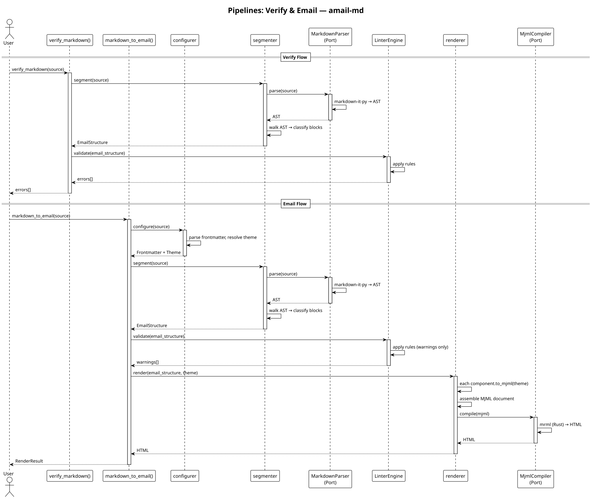

# amail-md

**Markdown to email-safe HTML. No Node.js. No MJML to write. Just Markdown.**

[](https://github.com/Aros-Team/amail_md/actions/workflows/tests.yml)
[](https://aros-team.github.io/amail_md/)
[](https://www.python.org/downloads/)
[](LICENSE)

---

## The Problem

Email HTML is a nightmare. Clients render differently, `<style>` blocks get stripped, div-based layouts break, and MJML requires a Node.js runtime just to compile templates.

Most developers end up either hand-crafting fragile HTML strings or pulling in heavy dependencies that don't fit a Python-native workflow.

## The Solution

amail-md takes a different approach: you write Markdown, and get email-safe HTML back. The library handles the hard parts internally:

- **Markdown parsing** via [markdown-it-py](https://github.com/executablebooks/markdown-it-py) (Python)
- **MJML compilation** via [mrml](https://github.com/jolim/mrml) (Rust, no Node.js required)
- **Dual output** -- HTML + text/plain in a single call
- **Deterministic** -- same input always produces the same output

```python
from amail_md import markdown_to_email

md = """
---
subject: Monthly Newsletter
---

# Hello World

This is **bold** and this is *italic*.

- Item 1
- Item 2
"""

result = markdown_to_email(md)
print(result.html)   # email-safe HTML
print(result.text)   # text/plain fallback
```

## Features

| Feature | Description |
|---------|-------------|
| **Deterministic** | Pure functions, same input always yields the same output |
| **Email-first** | Inline styles, table-based layout, responsive via MJML |
| **Dual output** | HTML and text/plain generated in one pass |
| **Themeable** | YAML frontmatter plus a customizable `Theme` dataclass |
| **Safe** | Input is escaped; no raw HTML injection |
| **No Node.js** | MJML compilation handled by a Rust binding (mrml) |
| **Minimal deps** | Only two runtime dependencies: markdown-it-py, mrml |

## Installation

```bash
pip install amail-md
```

Or with [uv](https://docs.astral.sh/uv/):

```bash
uv add amail-md
```

Requires Python 3.13+.

## Quick Start

### From Python

```python
from amail_md import markdown_to_email

result = markdown_to_email("# Hello\n\nWorld")
print(result.html)
```

### From the CLI

```bash
echo "# Hello\n\nWorld" | amail-md
```

### With Theme

```python
from amail_md import markdown_to_email

md = """
---
subject: Monthly Update
theme:
  primary_color: "#e63946"
  font_family: "Helvetica, sans-serif"
---

# Welcome

Your content here.
"""

result = markdown_to_email(md)
```

## What You Get

The `markdown_to_email` function returns a `RenderResult`:

| Field | Type | Description |
|-------|------|-------------|
| `html` | `str` | Email-safe HTML (responsive, inline styles) |
| `text` | `str` | text/plain fallback |
| `meta` | `dict` | Extracted metadata (subject, preheader...) |
| `warnings` | `list[str]?` | Optional conversion warnings |

## How It Works

The library follows a **Ports & Adapters** (hexagonal) architecture. The pipeline is a sequence of pure functions, each feeding the next:



Each stage is independently testable. No I/O, no global state, no hidden dependencies.

### EmailStructure Model

The intermediate representation between parser and compiler:

| Type | Role |
|------|------|
| `Paragraph` | Plain text block (default fallback) |
| `Heading` | Section headers (h1-h6) |
| `Button` | Call-to-action with href, text, variant |
| `List` | Ordered or unordered list |
| `Quote` | Blockquote for cited content |
| `Image` | Responsive image with alt text and src |
| `Divider` | Horizontal rule / separator |
| `Spacer` | Vertical spacing element |
| `Columns` | Multi-column layout container |
| `ColumnCell` | One column within a Columns block |
| `Table` | GFM table with column alignment |
| `Code` | Code block with syntax highlighting |
| `Link` | Hyperlink to external resources |

## Configuration

Configuration is driven by YAML frontmatter embedded in the Markdown document:

```markdown
---
subject: "Monthly Newsletter"
preheader: "Preview text here"
theme:
  primary_color: "#007bff"
  font_family: "Arial, sans-serif"
---

# Hello World

Your email content here.
```

The `Theme` dataclass defines the visual identity with 22 properties across colors, typography, layout, and dark mode support.

## Credits

Inspired by [emailmd](https://github.com/anypost/emailmd). We analyzed its
pipeline and chose a structured intermediate model over regex-based HTML
post-processing.

## Contributing

See the [Development Workflow](https://aros-team.github.io/amail_md/contributing/development/) for the full process.

The project enforces a **Docs, Test, Implement** workflow:

1. Write documentation first
2. Write tests that verify the documentation
3. Implement to make tests pass

```bash
# Run the quality harness
uv run python scripts/harness.py

# Run tests
uv run pytest

# Lint and type check
uv run ruff check src/ tests/
uv run mypy src/
```

## License

Apache License 2.0. See [LICENSE](LICENSE) for details.
